# HappyPets :cat2: :poodle:
## Seminarski rad za kurs PHP Programiranje na IT Akademiji
### Autor: Valentina Gmitrović
E-Mail: [gmitrovicvalentina1@gmail.com](mailto:gmitrovicvalentina1@gmail.com)

GitHub: [Vanja11](https://github.com/Vanja11)

Demo: [http://happypets.mojamackica.com](http://happypets.mojamackica.com)

## Opis aplikacije
Aplikacija **HappyPets** je namenjena ljubiteljima životinja koji žele da pomognu napuštenim, bolesnim i na bilo koji drugi način ugroženim životinjama. Trenutna verzija aplikacije omogućava brzo i jednostavno postavljanje oglasa za udomljavanje napuštenih životinja i prikazivanje potencijalnim udomiteljima.

Ideja za ovakav projekat je potekla od činjenice da je na ulicama svih gradova u Srbiji previše životinja koje su neodgovorni vlasnici izbacili, kao i onih o kojima nema ko da brine ili leči, s obzirom da nadležne institucije nisu zainteresovane za rešavanje ovog problema. Mali broj ljudi ima želju da pomogne ovim životinjama, ali oni nailaze na prepreke, kako novčane prirode, tako i teškog pronalaženja domova za njih.

## Korišćene tehnologije
- PHP
- MySQL
- Bootstrap
- jQuery

## Funkcije aplikacije

### Početna stranica
Na početnoj stranici korisnik može videti osnovne informacije o aplikaciji, čemu je namenjena, kao i prečice za dodavanje oglasa i kategorije postavljenih oglasa.

### Registracija

Da bi korisnik mogao da postavlja oglase, neophodno je da se registruje. 

Forma za registraciju sadrži polja:

- Ime, potrebno je da sadrži najmanje 2 karaktera
- Telefon, može biti sačinjen od cifara, kojih mora imati najmanje 9
- E-Mail Adresa, mora biti ispravna E-Mail adresa
- Lozinka, mora sadržati najmanje 6 karaktera

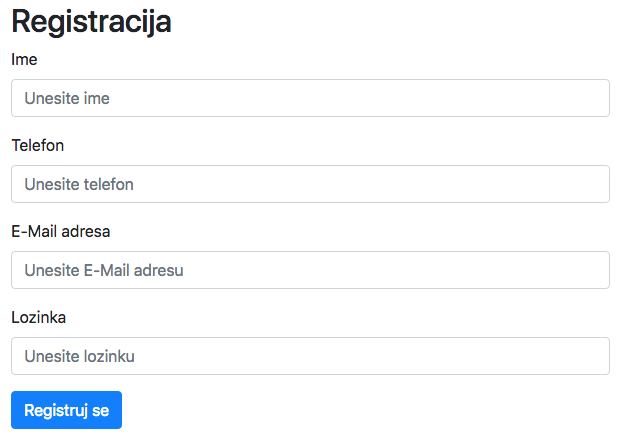


Ukoliko neko od ovih polja nije validno, korisniku će se prikazati greška, kao i forma za registraciju sa već popunjenim poljima.

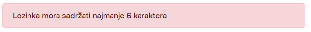

Nakon uspešne registracije, korisniku će biti prikazana poruka o uspešnoj registraciji sa instrukcijama za prijavljivanje na aplikaciju.

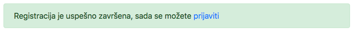

### Prijava
Nakon registracije, kao i prilikom ponovne posete, neophodno je da se korisnik prijavi na aplikaciju.

Forma za prijavu sadrži polja:

- E-Mail adresa koja je korišćena prilikom registracije
- Lozinka 

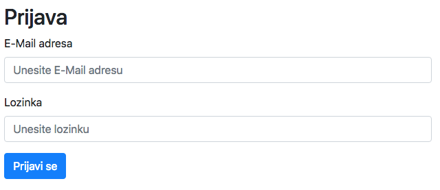

Nakon prijave, korisniku su dostupne opcije za dodavanje oglasa kao i za odjavljivanje sa aplikacije.

### Odjava
Kada korisnik želi da završi korišćenje aplikacije, može se odjaviti.

### Dodavanje oglsa
Prijavljeni korisnici imaju mogućnost dodavanja oglasa. Forma za dodavanje oglasa sadrži sledeća polja:

- Kategorija, padajući meni u kome su izlistane sve postojeće kategorije
- Naslov oglasa
- Tekst oglasa
- Telefon, nije obavezno polje. Ukoliko nije unet broj telefona, na oglasu će se prikazati broj telefona korisnika
- Slike, 5 file inputa

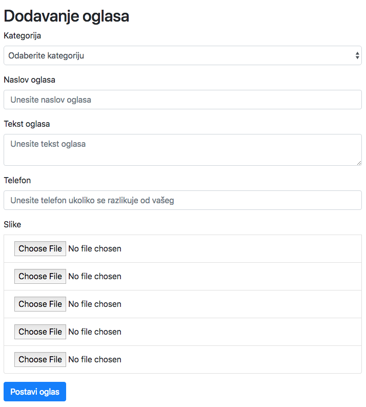


### Izmena oglasa
Ova stranica je identična stranici "Dodavanje oglasa", osim što su polja već popunjena informacijama o tom oglasu.

Takodje postoji i opcija uredjivanja već postavljenih fotografija (brisanje i dodavanje)

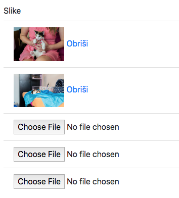

### Izlistavanje kategorije
Na ovoj stranici korisnik može videti oglase u odabranoj kategoriji. Oglas sadrži fotografiju, naslov, opis, ime korisnika koji je postavio oglas sa linkom do svih njegovih oglasa i datum postavljanja oglasa. 

Korisnik će takodje videti i dugme "Otvori oglas" koje će ga odvesti na detaljnije informacije o tom oglasu.

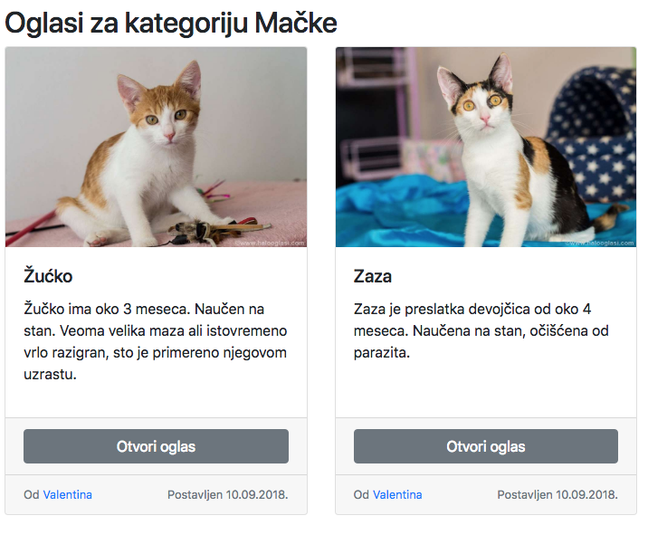


Ukoliko je oglas vlasništvo prijavljenog korisnika, dostupne su mu dodatne opcije:

- Obriši oglas
- Izmeni oglas
- Obnovi oglas (ova opcija se pojavljuje ukoliko je ostalo manje od 5 dana do isteka ili je oglas istekao)

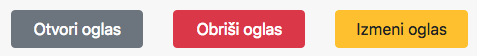

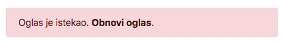


Oglasi su prikazani u vidu mreže, gde se u jednom redu prikazuje najviše 3 oglasa.

#### Brisanje oglasa
Kada korisnik pritisne dugme "Obriši oglas", postavlja mu se pitanje da li je siguran. Ukoliko korisnik odgovori potvrdno, oglas se briše, a na njegovom mestu se pojavljuje poruka da je oglas uspešno obrisan. Ova poruka je vidljiva samo korisniku koji je obrisao oglas, i to dok ne napusti stranicu.

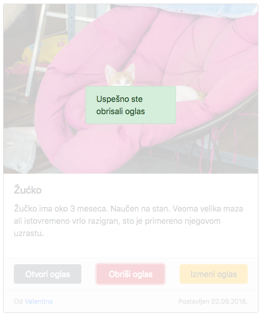


#### Izmena oglasa
Dugme vodi na stranicu [Izmena oglasa](###-Izmena-oglasa) 

#### Obnavljanje oglasa
Klikom na ovaj link, korisnik će obnoviti oglas na mesec dana, a poruka o isteku oglasa će se zameniti porukom o uspešnom obnavljanju oglasa.

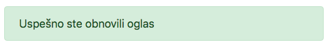


### Izlistavanje oglasa korisnika
Ova stranica je identična stranici "Izlistavanje kategorije", ali umesto oglasa iz kategorije, prikazuju se svi oglasi izabranog korisnika.

### Oglas
Na ovoj stranici su prikazane sve informacije o oglasu i to:

- Naslov
- Opis
- Ime i broj telefona korisnika koji je postavio oglas
- Slideshow sa najviše 5 fotografija

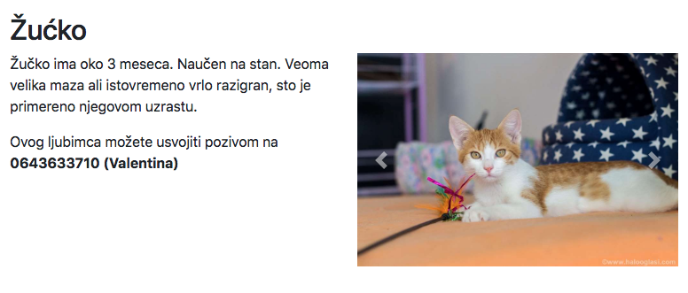


### Kontakt
Kontakt forma putem koje će posetilac moći da kontaktira autora aplikacije.

Ukoliko je korisnik prijavljen, polja za ime i E-Mail adresu će biti popunjena i onemogućena.

## Struktura projekta

Projekat je baziran na MVC (Model-View-Controller) arhitekturi koja je za potrebe ovog projekta uprošćena na taj način što ne postoje posebni modeli za svaku tabelu u bazi, već se sve obavlja iz jedne klase.

Prednost MVC arhitekture je u tome što je izvršavanje i pisanje aplikacije odvojeno na 3 sloja, čime se značajno doprinosi lakšem pisanju i čitanju koda, uz smanjenu mogućnost grešaka od strane programera.

- **Model** omogućava pristup bazi podataka
- **View** je prezentacioni sloj
- **Controller** je zadužen za svu poslovnu logiku

### Direktorijumi
U sledećoj tabeli su izlistani direktorijumi sa opisom:

| Naziv direktorijuma | Opis |
| --- | --- |
| [controllers](controllers) | Kontroleri, pripremaju podatke potrebne za prikaz stranice |
| [css](css) | Stilovi |
| [images](images) | Statičke slike |
| [js](js) | JavaScript biblioteke i skripte potrebne za funkcionisanje aplikacije |
| [layout](layout) | Kostur aplikacije (header i footer) |
| [lib](lib) | Biblioteke aplikacije |
| [uploads](uploads) | Direktorijum za upload fotografija |
| [views](views) | Kontroler koristi view za konačno oblikovanje i prikaz stranice ili elementa |

### Fajlovi
Pored gore navedenih direktorijuma u projektu postoje i sledeći fajlovi:

| Naziv fajla | Opis |
| --- | --- |
| [ajax.php](ajax.php) | Obrada AJAX zahteva |
| [config.php](config.php) | Konfiguracija aplikacije |
| [index.php](index.php) | Index |

### Baza podataka
Struktura baze se može videti na dijagramu:

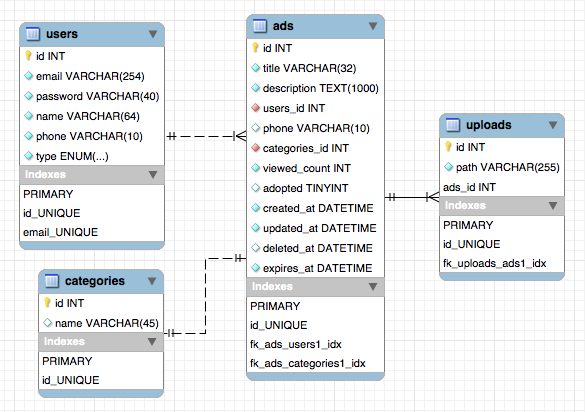

### PHP Kôd
#### index.php
Svaki zahtev napravljen na aplikaciji, mora proći kroz *index.php* fajl, izuzev AJAX (Asynchronous JavaScript and XML) zahteva.

Na samom početku fajla se štitimo od potencijalnog hakerskog napada, koji bi omogućio čitanje bilo kog fajla na serveru.

```php
if (strstr($_GET['page'], '/') !== false) {
    die('Ovo nije dozvoljeno');
}
```
Upotrebom *strstr* funkcije, proveravamo da li `$_GET['page']` sadrži karakter `\`, i ukoliko sadrži, sprečavamo korisnika da na taj način inkluduje neki PHP fajl van direktorijuma `controllers` tako što bi pokušao da se vrati direktorijum unazad (na primer `../lib/db.php`).

Zatim definišemo konstantu `IN_PAGE` kojom ćemo se u ostalim PHP fajlovima osigurali od pokušaja direktnog pristupa umesto kroz `index.php` fajl.

```php
define('IN_PAGE', true);
```

Inkludujemo dodatne potrebne fajlove
```php
include('config.php'); // Konfiguracija parametara aplikacije
include('lib/db.php'); // Klasa za pristup bazi podataka
include('lib/view.php'); // View klasa
```

Pošto nam je u aplikaciji potrebna sesija koristimo funkciju *session_start*
```php
session_start();
```

Instanciramo klasu za pristup bazi podataka
```php
$db = new DB();
```

Na kraju inkludujemo željeni kontroler na osnovu `$_GET['page']` parametra. Ukoliko on nije postavljen, inkludovaćemo *home* kontroler. Ukoliko željeni kontroler ne postoji, inkludujemo *404* kontroler koji predstavlja nepostojeću stranicu.

```php
$page = $_GET['page'] ? $_GET['page'] : 'home';

if (file_exists('controllers/' . $page . '.php')) {
    include('controllers/' . $page . '.php');
} else {
    include('controllers/404.php');
}
```

#### ajax.php
Ovaj fajl služi za obradu AJAX zahteva. Trenutno su podržane 3 funkcije i to za brisanje oglasa, brisanje fotografija i obnavljanje oglasa.

Dosta je sličan `index.php` fajlu, osim što umesto inkludovanja kontrolera, izvršava funkcije koje se nalaze u njemu.

Prvo proveravamo da li je poslat parametar kojim se bira željena funkcija, a ukoliko nije, prekidamo skriptu greškom.

Obzirom da se radi o AJAX zahtevu, želimo da sadržaj vratimo u JSON formatu, koji lako možemo obraditi iz JavaScripta.

```php
if (!isset($_GET['func'])) {
    die(json_encode([
        error => 'Mora biti odabrana funkcija'
    ]));
}
```

Zatim definišemo funkcije
```php
function deleteAd() {
    ...
}
function deletePhoto() {
    ...
}
function renewAd() {
    ...
}
```

I na kraju proveravamo da li željena funkcija postoji korišćenjem `function_exists` funkcije, i izvršavamo je pomoću `call_user_func` funkcije koja služi za pozivanje funkcije na osnovu prosledjene promenljive.

```php
if (function_exists($_GET['func'])) {
    call_user_func($_GET['func']);
} else {
    die(json_encode([
        error => 'Funkcija ne postoji'
    ]));
}
```

#### lib/db.php
Klasa koja nam omogućava da pristupimo bazi. 

U konstruktoru klase ostvarujemo konekciju na MySQL bazu podataka

```php
function __construct() {
    $this->mysqli = new mysqli(DB_HOST, DB_USERNAME, DB_PASSWORD, DB_DATABASE, DB_PORT);
    if ($this->mysqli->connect_errno) {
        die('Failed to connect to MySQL: (' . $this->mysqli->connect_errno . ') ' . $this->mysqli->connect_error);
    }
}
```

Ostatak ove klase čine metode koje za zadatak imaju da omoguće čitanje i upis u bazu podataka.

Za primer ćemo uzeti metodu `getUser`

```php
 public function getUser($user) {
    if ($statement = $this->mysqli->prepare('SELECT * FROM users WHERE id = ?')) {
        $statement->bind_param('i', $user);

        if ($statement->execute()) {
            $res = $statement->get_result();
            $users = $res->fetch_all(MYSQLI_ASSOC);
            $statement->close();

            if (count($users) > 0) {
                return $users[0];
            }
        }
    }
    return null;
}
```
Analiziraćemo u nastavku `getUser` metodu.

Za izvršenje SQL upita su korišćeni *prepared statementi* kako bi se na što efikasniji način sprečili potencijalni napadi putem ubrizgavanja SQL koda kroz POST i GET parametre.

```php
$statement = $this->mysqli->prepare('SELECT * FROM users WHERE id = ?')
```

Zatim ćemo zameniti parametre u pripremljenom upitu pomoću `bind_param` metode. Obzirom da želimo da parametar koji prosledjujemo upitu bude *integer*, za tip ćemo koristiti `i`, i prosledićemo ID željenog korisnika, u ovom slučaju sadržanog u promenljivoj `$user`
```php
$statement->bind_param('i', $user);
```

Izvršavamo, odnosno šaljemo upit MySQL serveru

```php
$statement->execute()
```

Ukoliko je sve u redu sa izvršenjem upita, pomoću `get_result` metode ćemo uzeti rezultat.
```php
$res = $statement->get_result();
```

Potom je potrebno da iz rezultata preuzmemo niz korisnika koji su vraćeni u rezultatu. Ovo ćemo postići metodom `fetch_all`, koja kao parametar prima tip niza koji će biti vraćen. Pošto nas interesuje da to bude asocijativni niz, koristićemo `MYSQLI_ASSOC` tip.
```php
$users = $res->fetch_all(MYSQLI_ASSOC);
```

Nakon završenog rada sa pripremljenim upitom, zatvorićemo ga kako bismo oslobodili memoriju.
```php
$statement->close();
```

Vratićemo prvi rezultat ukoliko postoji, jer je to naš željeni korisnik
```php
if (count($users) > 0) {
    return $users[0];
}
```

Ukoliko je ranije došlo do nekog problema, pošto nisu ispunjeni uslovi, nastaviće se dalje izvršavanje skripte, i ona će konačno vratiti `null`, i na taj način indikovati da korisnik nije pronadjen.

#### lib/view.php
Jednostavna View klasa koja omogućava učitavanje viewa, postavljanje i čitanje promenljivih, zaštitu od XSS (Cross Site Scripting) i render stranice.

Konstruktor klase prima dva argumenta, i to putanju do fajla i da li će se renderovati header i footer. Putanju postavljamo u privatan property `$viewPath`, i istovremeno dodeljujemo prazan niz privatnom propertyju `$vars`. Ovaj property će služiti za čuvanje promenljivih koje će biti dostupne unutar view-a. Property `$renderLayout` ćemo koristiti kao uslov za prikazivanje headera i footera stranice.

```php
function __construct($viewPath) {
    $this->viewPath = $viewPath;
    $this->vars = [];
}
```

Koristimo magične `__get` i `__set` metode za postavljanje i čitanje promenljivih
```php
public function __get($name) {
    return isset($this->vars[$name]) ? $this->vars[$name] : null;
}

public function __set($name, $value) {
    $this->vars[$name] = $value;
}
```

Zatim imamo `escape` metodu koju ćemo koristiti iz view-a kako bismo sprečili da korisnik unese XSS kod. Bez ovoga bi korisnik mogao da na primer kao tekst oglasa upiše `<script>window.location='http://www.nekisajt.com'</script>` te bi svaki posetilac stranice na kojoj se ispisuje ovaj tekst automatski bio preusmeren na stranicu `http://www.nekisajt.com`. Kao zaštitu koristimo `htmlspecialchars` funkciju koja zamenjuje HTML karaktere poput `<` i `>` u `&lt;` i `&gt;` i na taj način će se ovakav tekst samo prikazati u browseru.
```php
public function escape($str) {
    return htmlspecialchars($str);
}
```

Za render koristimo `ob_start` funkciju kojom započinjemo čuvanje celokupnog sadržaja koji bi se štampao na ekran. 

Nakon toga inkludujemo layout ukoliko je potrebno, i view fajl.

Funkcijom `ob_get_clean` sačuvani sadržaj preuzimamo u promenljivu `$buffer` i istovremeno brišemo sačuvani sadržaj iz privremene memorije, i nakon toga vraćamo taj rezultat. Ova metoda je privatna pošto joj se neće pristupati spolja.
```php
private function render() {
    ob_start();

    if ($this->renderLayout) {
        include('layout/header.php');
    }
    
    include($this->viewPath);

    if ($this->renderLayout) {
        include('layout/footer.php');
    }

    $buffer = ob_get_clean();

    return $buffer;
}
```

Magična metoda `__toString` će se pozvati kada iz nekog kontrolera pozovemo `echo $view` ili na neki drugi način `$view` pretvorimo u string (na primer konkatenacijom)
```php
public function __toString() {
    return $this->render();
}
```

#### Primer kontrolera
Kao primer kontrolera uzećemo `create.php` pošto je to kontroler koji obuhvata validaciju ulaznih parametara, korišćenje viewa, upis u bazu i postavljanje fotografija.

Na početku samog kontrolera proveravamo da li je učitan kroz `index.php` fajl ili mu je neko pristupio direktno, što želimo da sprečimo

```php
if (!defined('IN_PAGE')) {
    die ('Ovo nije dozvoljeno');
}
```

Instanciramo View klasu sa putanjom `views/pages/create.php`.

```php
$view = new View('views/pages/create.php');
```

Pozivamo metodu `getCategories` iz DB klase kako bismo preuzeli spisak dostupnih kategorija, i smeštamo ga u view promenljivu `categories`

```php
$view->categories = $db->getCategories();
```

Zatim proveravamo da li je forma poslata, i ako jeste postavljamo view promenljive `posted` i `postData`

```php
if (!empty($_POST)) {
    $view->posted = true;
    $view->postData = $_POST;
```

Radimo validaciju forme, i postavljamo promenljivu `$error` na grešku ukoliko postoji

```php
if (!$_POST['category'] || $_POST['category'] === '') {
    $error = 'Odaberite kategoriju';
} else if (!$_POST['title'] ) {
    $error = 'Unesite naslov oglasa';
} else if (!$_POST['description'] ) {
    $error = 'Unesite tekst oglasa';
} else if ($_POST['phone'] && strlen($_POST['phone']) < 9) {
    $error = 'Telefon mora sadržati najmanje 9 cifara';
} else if ($_POST['phone'] && !is_numeric($_POST['phone'])) {
    $error = 'Telefon je neispravan';
}
```

Grešku takodje prosledjujemo i view-u

```php
$view->error = $error;
```

Ukoliko je forma validna, odnosno nema greške, pozivamo metodu `create` iz DB klase i rezultat koji će biti ID oglasa smeštamo u view promenljivu `adId`

```php
if (!$error) {
    $view->adId = $db->create($_POST['category'], $_POST['title'], $_POST['description'], $_POST['phone'], $_FILES['photos']);
}
```

Sledi deo `create` metode koji je zadužen za upload fotografija

```php
for ($i = 0; $i < 5; $i++) {
    if ($photos['tmp_name'][$i] !== '' && strpos($photos['type'][$i], 'image/') === 0) {
        $this->uploadPhoto($adId, $photos['name'][$i], $photos['tmp_name'][$i]);
    }
}      
```

`uploadPhoto` metoda koristi `move_uploaded_file` funkciju kako bi iz privremenog direktorijuma premestila fotografiju u `uploads` direktorijum, i na kraju čuva podatke o fotografiji u tabelu `uploads`

```php
move_uploaded_file($path, 'uploads/' . $filePath);

if ($statement = $this->mysqli->prepare('INSERT INTO uploads (path, ads_id) VALUES (?, ?)')) {
    $statement->bind_param('ss', $filePath, $adId);

    $statement->execute();
    $statement->close();
}
```

Na kraju je potrebno da ispišemo renderovan view na ekran

```php
echo $view;
```

### JavaScript Kôd

U projektu imamo samo jedan JavaScript fajl, `main.js` koji je uglavnom zadužen za slanje i obradu AJAX zahteva. Koristimo ga za brisanje oglasa, brisanje fotografija i obnavljanje oglasa, te imamo 3 funkcije: `deleteAd`, `deletePhoto` i `renewAd`

Navešćemo samo primer `deleteAd` funkcije.

Funkcija `deleteAd` prima 2 argumenta: ID oglasa i element, odnosno dugme koje je korisnik kliknuo

```javascript
function deleteAd(id, element) {
```

Želimo da pitamo korisnika da li je siguran da želi da obriše oglas, pošto će se on trajno obrisati iz baze podataka

```javascript
if (confirm('Da li ste sigurni da želite da obrišete ovaj oglas?')) {
```

Ukoliko želi, šaljemo AJAX zahtev na adresu `ajax.php?func=deleteAd&ad=[ID Oglasa]`

```javascript
$.ajax({
    url: 'ajax.php?func=deleteAd&ad=' + id,
})
```

Po uspešnom završetku ovog zahteva, koristeći jQuery, ćemo na osnovu elementa koji je prosledjen kao argument funkcije, pronaći element samog oglasa i u njega ubaciti dodatan sadržaj koji će predstavljati poruku o uspešnom brisanju oglasa

```javascript
.done(function () {
    $(element)
        .parents('.card')
        .append('<div class="deletedAd"><div class="alert alert-success" role="alert">Uspešno ste obrisali oglas</div></div>');
});
```

## Zaključak
